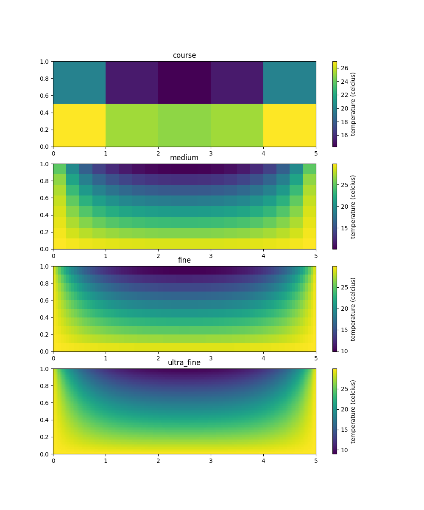
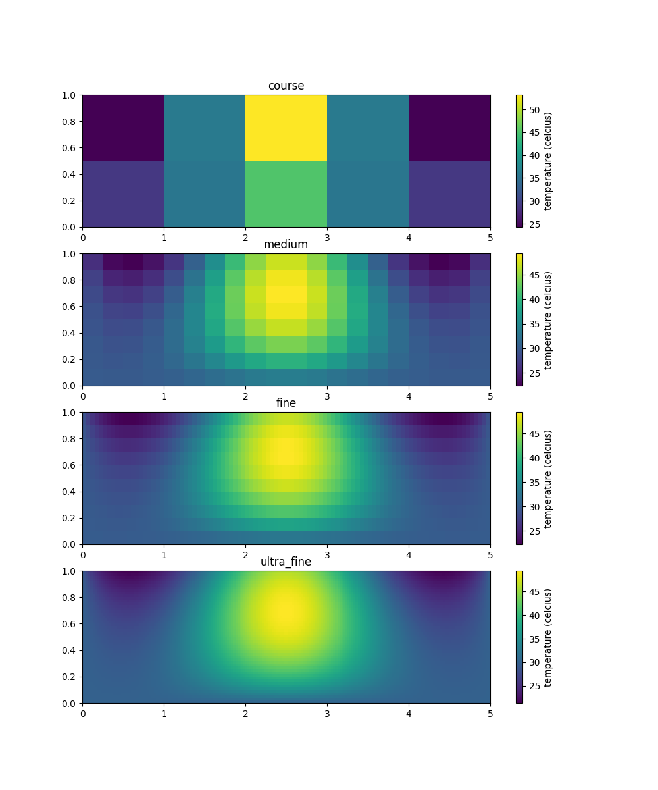
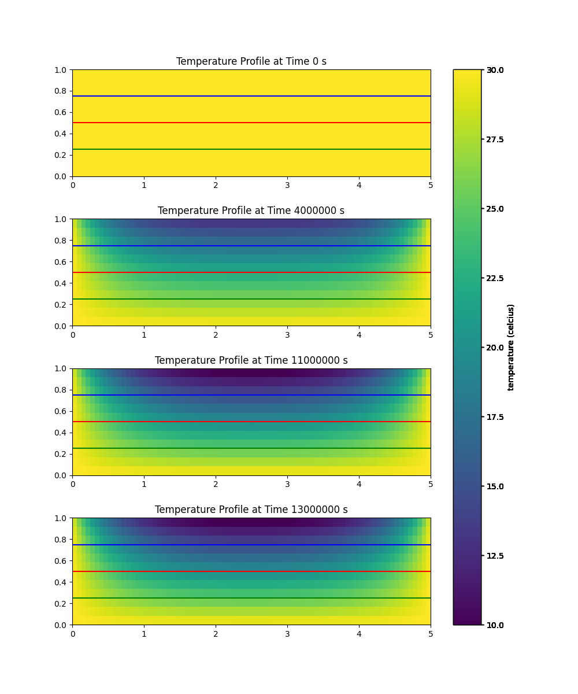
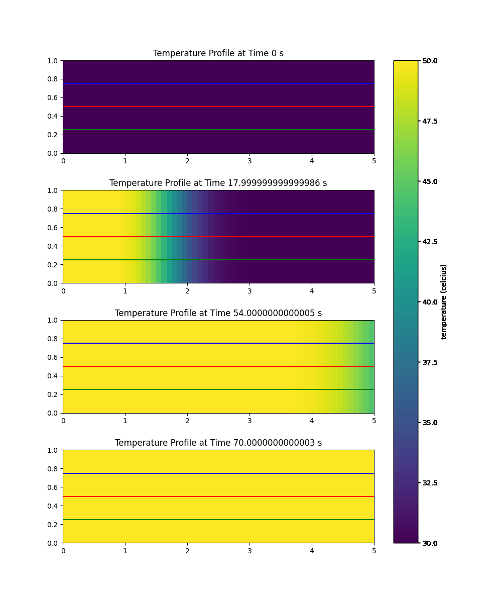
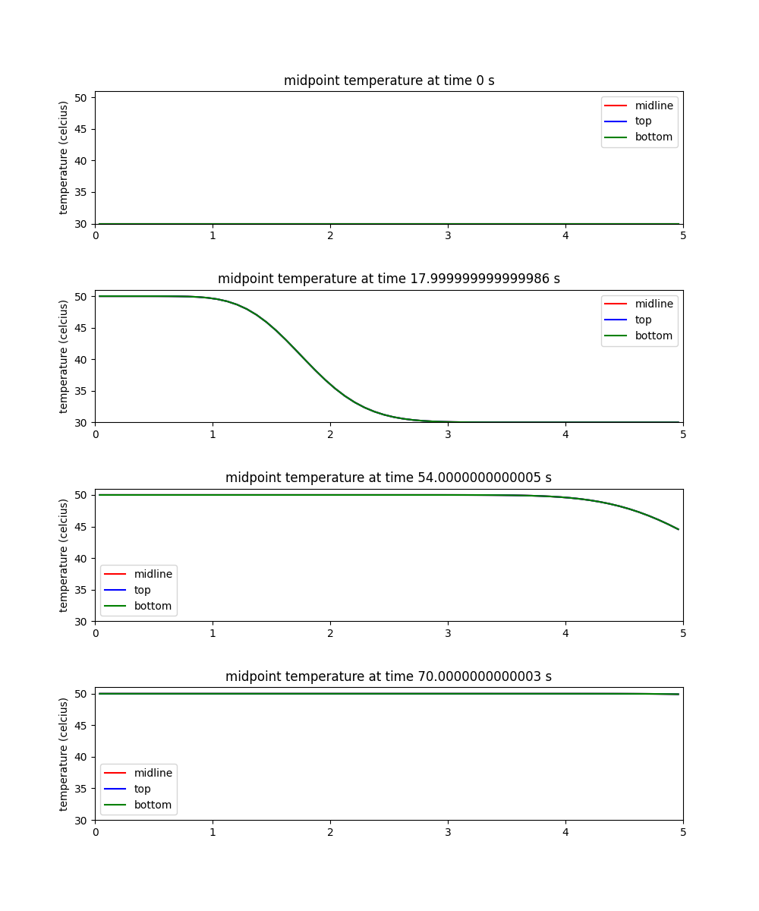
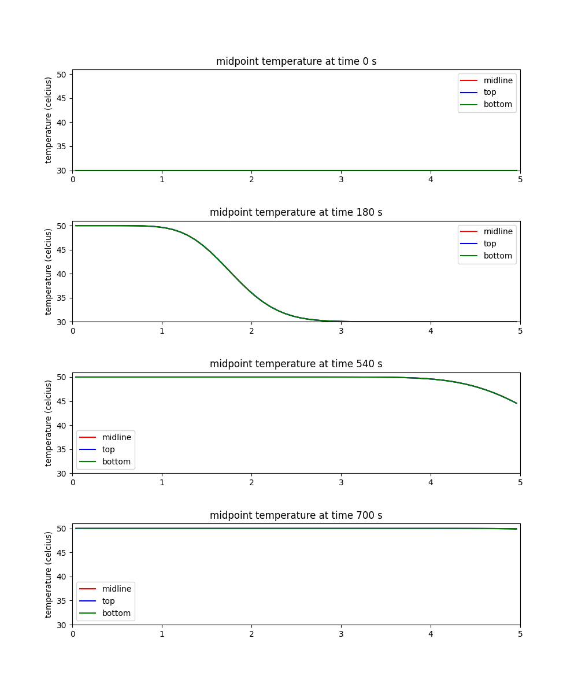
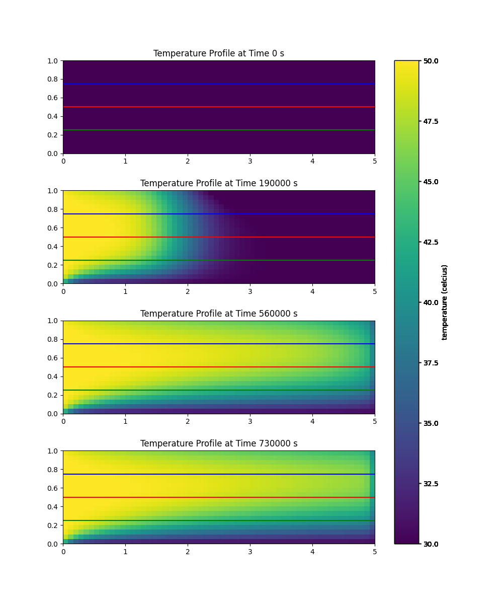
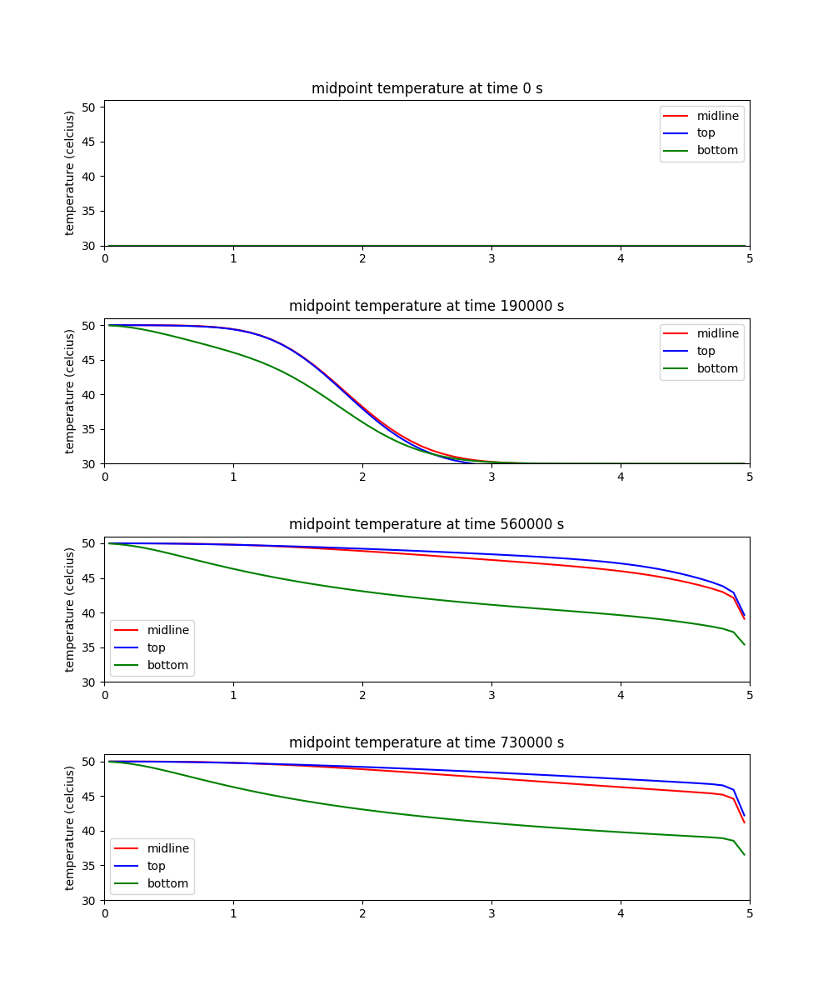
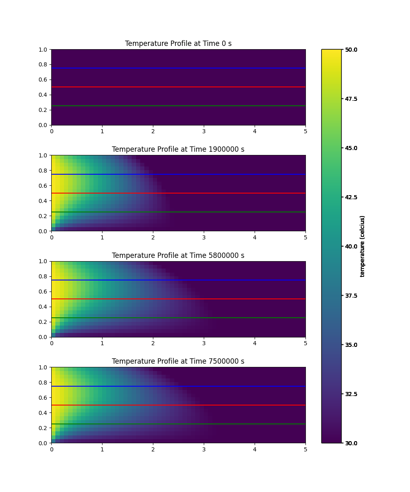
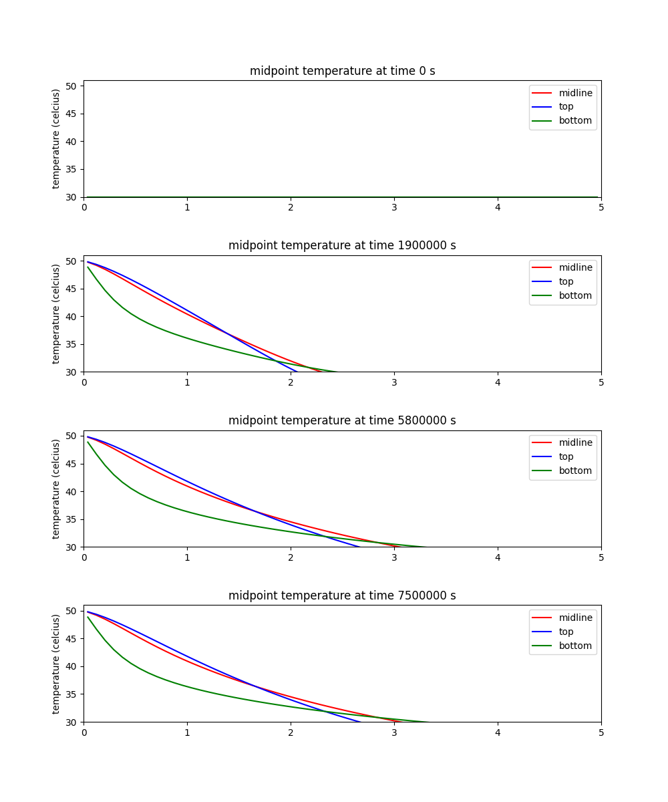

# Problem Description

## Integral Equation

This problem considers the 2 dimensional advection diffusion equation, which in its integral form can be written as

\begin{equation}
\frac{d}{dt} \int _\Omega \phi  d\Omega = - \int _S \phi \textbf{V} \cdot \textbf{n} dS  \int _S \alpha \nabla \phi \cdot \textbf{n} dS + \int _\Omega Q d\Omega
\end{equation}

## Descriptions

Part 1 condsiders the steady state problem with no advection or generation terms for a thin water column with the spatial domain of  $x \epsilon(0,5m)$ and $y \epsilon(0,1m)$ with a dirichlet boundary conditions of $30^{\circ} c$ on the left, bottom, and top surface and a neumann boundary condition of $q = 10 \frac{W}{m^2}$ on the top surface

Part 2 condsiders the same formulation as part 1 with an added source term $Q = 50e^{-(x-\frac{L}{2})^2}$

Part 3 considers the unsteady case of part 1, starting from an initial condition of $T(0,x,y) = 30^{\circ} c$ until a steady state is achieved

Part 4 considers the advection-diffusion problem with a left dirichelet boundary condition of $50 ^{\circ} c$, for three constant velocities $\textbf{V} = [0.01,0], [0.1,0], [1,0] m/s$

## Discritized Equations

The first term of equation 1 discritized on a cartesian structured grid by approximating the volumetric inegral's average as being its center point and discritizing the time derivative using a forward discritization.

\begin{equation}
\frac{d}{d t} \int _\Omega  \phi d\Omega = \frac{d}{d t} \bar{\phi}\Delta x \Delta y \approx \frac{d}{d t} \phi _i\Delta x \Delta y \approx \frac{\phi^{n+1} _i - \phi ^ n _i}{\Delta t} \Delta x \Delta y + O(\Delta t)
\end{equation}

Due to the velocitys all being in the positive x direction, the second term can be discritized using an upwind discritization.

\begin{equation}
 -\int _S \phi \textbf{V} \cdot \textbf{n} dS   \approx u_x(\phi_L - \phi _i) \Delta y +O(\Delta x , \Delta t)
\end{equation}

where ux is the velocity magnitude in the x direction and $\phi _W$ coresponds to value of phi for the cell next to the current cell in the the west cardinal dircetion. Of note, the $\Delta x$ discritization here will make the entire equation 1st order accurate spatial discritization. Note: The convection of refering to the cells surrounding the current cell as N = North, E = East, W = West, S = South
and the lowercase equivalent refering to the respective face intersections between will be used throuhout this report)

the third diffusive flux term can be discritized using the central difference. Assuming a constant diffusivity paramater this results in

\begin{equation}
 \int _S \alpha \nabla \phi \cdot \textbf{n} dS \approx \alpha \frac{\phi _L -2 \phi _i +\phi _R}{\Delta x} \Delta y + \alpha \frac{\phi _S -2 \phi _i +\phi _N}{\Delta y} \Delta x + O(\Delta x^2 ,\Delta y^2)
\end{equation}

The last source term can again be approximated as the value at its mid point

\begin{equation}
\int _\Omega Q d\Omega \approx Q_i\Delta x \Delta y
\end{equation}

Combining the equations 2 - 5 and deviding both sided by $\Delta x \Delta y$ and multipying the source term (given in units of $\frac{W}{m^2}$) by $\frac{\alpha}{k}$ results in the final discritized equation

\begin{equation}
\frac{\phi^{n+1} _i - \phi ^ n _i}{\Delta t} = \frac{u_x(\phi_L - \phi _i)}{\Delta x} + \alpha \frac{\phi _L -2 \phi _i +\phi _R}{\Delta x ^2} + \alpha \frac{\phi _S -2 \phi _i +\phi _N}{\Delta y^2} + \ Q_i \frac{\alpha}{k} +O(\Delta t, \Delta x, \Delta y)
\end{equation}

Finally, the source term was given in

## Boundary Conditions

For the boundary conditions, we can modify equation 6 on the boundaries using the ghost cell approach using the known quantities. Shown here for the left dirichlet boundaries

\begin{equation}
\frac{\phi _L+ \phi _i}{2} = T_{left}
\end{equation}

allows solving for the dirichlet equations on the boundaries

\begin{equation}
\phi _L = 2T_{left}-\phi _i
\end{equation}

Simillarly for the right

\begin{equation}
\phi _R = 2T_{right}-\phi _i
\end{equation}

and bottom boundaries

\begin{equation}
\phi _S = 2T_{bottom}-\phi _i
\end{equation}

The neumann boundary can be determined from the flux term

\begin{equation}
q = k \frac{\delta T}{\delta y} \approx k \frac{\phi _N - \phi _i}{\Delta y}
\end{equation}

where k is the materials thermal conductivity.
Solving for $\phi _n$

\begin{equation}
\phi _N = \frac{q \Delta y}{k} +\phi _i
\end{equation}

\newpage

# Installation

The code used in this project has been published as a pypi package and can be installed using pip.

    pip install bray-pde

Then from python session the examples can be imported using

    import solver.code_project.main as project

Each solution can then be ran independently as

    project.SteadyState()
    project.Generation()
    project.Transient()
    project.AdvectionDiffusion()

Or all at once

    project.main()

# Problem Constants

Based on the problem description, at atmospheric pressure the thermal diffusivity ranges from $0.155 *10^{-6} \frac{m^2}{s}$ at 50 degrees celcius, to $0.143 * 10^ {-6} \frac{m^2}{s}$ at 20 degrees celsius. A constant thermal diffusivity of $0.146 * 10^{-6} /frac{m^2}{s}$ for water at standard temperature and pressure (25 degrees celcius at atmospheric pressure) was used for this project as the error introduced due to this symplifying assumption was determined to be acceptable <a href="#citeproc_bib_item_1">[1]</a>

The water thermal conductivity taken to be a constant at $0.456 \frac{W}{mK}$ again coresponding to a temperature of 25 degrees celcius. <a href="#citeproc_bib_item_2">[2]</a>

    from solver.cartesian_mesh import CartesianMesh
    from solver.solver import Solver
    from solver.utilities import EnergyBalance, Plotter, VelocityRounder
    from solver.mesher import linear_convection_mesh
    from matplotlib import pyplot as plt
    import numpy as np
    import logging
    import math

    #create logging configuration
    logger = logging.getLogger(__name__)
    logger.setLevel(logging.INFO)

    console_handler = logging.StreamHandler()
    console_handler.setLevel(logging.INFO)
    formatter = logging.Formatter(
      "%(message)s",
    )
    console_handler.setFormatter(formatter)
    logger.addHandler(console_handler)

    class Setup:
        def __init__(self,
                     x_range = (0,5),
                     y_range = (0,1),
                     mesh_type = "finite_volume",
                     conductivity = 0.456,
                     diffusivity = 0.146*10**(-6),
                     temp_left = 30,
                     temp_right = 30,
                     temp_bottom = 30,
                     top_flux = -10,
                     ):

            self.mesh_size_dict = {
                "course":(5,2),
                "medium": (20,8),
                "fine":(100,10),
                "ultra_fine":(200,50)
            }
            # Define Problem constants
            self.x_range = x_range
            self.y_range = y_range
            self.mesh_type = mesh_type
            self.conductivity = conductivity # W/mk
            self.diffusivity = diffusivity #m^2/s
            self.temp_left = temp_left #celcius
            self.temp_right = temp_right #celcius
            self.temp_bottom = temp_bottom #celcius
            self.top_flux = top_flux #celcius

            # Create a function that creates the mesh
        def create_mesh(
                self,
                x_cells = 80,
                y_cells = 12,

        ):
            mesh = CartesianMesh(
                dimensions=2,
                n_cells=[x_cells, y_cells],
                cordinates=[self.x_range, self.y_range],
            mesh_type= self.mesh_type,
            conductivity = self.conductivity,
            diffusivity = self.diffusivity
        )

            mesh.set_dirichlet_boundary(side="left", phi=self.temp_left)
            mesh.set_dirichlet_boundary(side="right", phi=self.temp_right)
            mesh.set_dirichlet_boundary(side="bottom", phi=self.temp_bottom)
            mesh.set_neumann_boundary(side="top", flux = self.top_flux/self.conductivity)
            return(mesh)

        def plot_steady(self, mesh_dictionary, plot_name):
              fig, ax = plt.subplots(len(mesh_dictionary), figsize= (10,12))
              i = 0
              for  mesh_size, mesh in mesh_dictionary.items():

                  x_cords = mesh.grid["x_grid"].cell_cordinates
                  y_cords = mesh.grid["y_grid"].cell_cordinates
                  logger.debug(x_cords)
                  xv, yv = np.meshgrid(x_cords, y_cords)
                  axis = plt.subplot(len(mesh_dictionary),1,i+1)
                  axis.set_title(mesh_size)
                  steady = axis.pcolormesh(xv, yv, mesh.phi.get_phi())

                  i = i +1

                  fig.colorbar(steady, label = "temperature (celcius)")
              plt.savefig(plot_name)

# Part 1 Steady State

    class SteadyStateSolver:
       def __init__(self, settings = Setup()):
          self.settings = settings

       def solve(self):
          self.mesh_dict = {}
          energy_balance_dict = {}
          for mesh_size , cells in self.settings.mesh_size_dict.items():
             x_cells , y_cells  = cells

             self.mesh_dict[mesh_size] = self.settings.create_mesh(
                x_cells = x_cells,
                y_cells=y_cells
             )
             # Solve the steady Case
             Solver(mesh = self.mesh_dict[mesh_size]).solve_steady()
             energy_balance_dict[mesh_size] = EnergyBalance(mesh = self.mesh_dict[mesh_size])
             logger.info(f"\n Mesh Size:{mesh_size}")
             total_flux = energy_balance_dict[mesh_size].flux("all")

       def plot(self):
          fig, ax = plt.subplots(len(self.mesh_dict), figsize= (10,12))
          i = 0
          for  mesh_size, mesh in self.mesh_dict.items():

             x_cords = mesh.grid["x_grid"].cell_cordinates
             y_cords = mesh.grid["y_grid"].cell_cordinates
             logger.debug(x_cords)
             xv, yv = np.meshgrid(x_cords, y_cords)
             axis = plt.subplot(len(self.mesh_dict),1,i+1)
             axis.set_title(mesh_size)
             steady = axis.pcolormesh(xv, yv, mesh.phi.get_phi())

             i = i +1

             fig.colorbar(steady, label = "temperature (celcius)")
             plt.savefig("steady.png")

    def SteadyState():
        steady = SteadyStateSolver()
        steady.solve()
        steady.plot()

    SteadyState()

     Mesh Size:course
    solver.utilities:INFO:flux:
     Left Flux: 5.984599731767105 W
     Right Flux: 5.984599731767105 W
     Bottom Flux: 38.03080053646583 W
     Generation: 0.0 W
     Top Flux: -50.0 W
     Cell Sum Squared Error: 8.131861707906003e-28 W
     Flux leaving boundarys: 4.440892098500626e-14W
     Total Flux: 4.440892098500626e-14

     Mesh Size:medium
    solver.utilities:INFO:flux:
     Left Flux: 7.330052111172102 W
     Right Flux: 7.330052111172095 W
     Bottom Flux: 35.339895777655755 W
     Generation: 0.0 W
     Top Flux: -50.0 W
     Cell Sum Squared Error: 2.2277109653610886e-26 W
     Flux leaving boundarys: -5.684341886080802e-14W
     Total Flux: -5.684341886080802e-14

     Mesh Size:fine
    solver.utilities:INFO:flux:
     Left Flux: 7.410898164506065 W
     Right Flux: 7.4108981645061895 W
     Bottom Flux: 35.178203670991046 W
     Generation: 0.0 W
     Top Flux: -49.99999999999999 W
     Cell Sum Squared Error: 1.7166707559454444e-25 W
     Flux leaving boundarys: 3.304023721284466e-12W
     Total Flux: 3.304023721284466e-12

     Mesh Size:ultra_fine
    solver.utilities:INFO:flux:
     Left Flux: 7.417294624355647 W
     Right Flux: 7.417294624356283 W
     Bottom Flux: 35.165410751328 W
     Generation: 0.0 W
     Top Flux: -50.0 W
     Cell Sum Squared Error: 1.6155439387848486e-24 W
     Flux leaving boundarys: 3.991829089500243e-11W
     Total Flux: 3.991829089500243e-11

Due to the finite volume scheme, the total flux error and the sum of each cells squared error is relativly independent of mesh size. The overall error increases slightly with the higher number of points due to the numerical round off error present with the higher number of calcualtions.

# Part 2: With Generation

    class GenerationSolver:
        def __init__(self, settings = Setup()):
            self.settings = settings
        def solve(self):
            self.generation_mesh_dict = {}
            generation_energy_balance_dict = {}
            def gen_function (x, y):
                return(0*y+ 50*np.exp(-(x-2.5)**2))
            for mesh_size , cells in self.settings.mesh_size_dict.items():
                x_cells , y_cells  = cells

                #Create the mesh
                self.generation_mesh_dict[mesh_size] = self.settings.create_mesh(
                    x_cells = x_cells,y_cells=y_cells)

                #Add the generation function
                self.generation_mesh_dict[mesh_size].set_generation(function = gen_function)

                # Solve the steady Case with generation
                Solver(
                    mesh = self.generation_mesh_dict[mesh_size]
                ).solve_steady()
                generation_energy_balance_dict[mesh_size] = EnergyBalance(
                    mesh = self.generation_mesh_dict[mesh_size])
                logger.info(f"\n Mesh Size:{mesh_size}")
                total_flux = generation_energy_balance_dict[mesh_size].flux("all")
        def plot(self):
            self.settings.plot_steady(self.generation_mesh_dict, "generation.png")

    def Generation():
        generation = GenerationSolver()
        generation.solve()
        generation.plot()

    Generation()

     Mesh Size:course
    solver.utilities:INFO:flux:
     Left Flux: 3.050929235793739 W
     Right Flux: 3.050929235793736 W
     Bottom Flux: -44.721366477605116 W
     Generation: 88.61950800601765 W
     Top Flux: -50.0 W
     Cell Sum Squared Error: 1.3769936879182083e-27 W
     Flux leaving boundarys: -88.61950800601764W
     Total Flux: 1.9984014443252818e-14

     Mesh Size:medium
    solver.utilities:INFO:flux:
     Left Flux: 4.701073325592375 W
     Right Flux: 4.70107332559235 W
     Bottom Flux: -47.991201972823 W
     Generation: 88.58905532163828 W
     Top Flux: -50.0 W
     Cell Sum Squared Error: 2.551527219976484e-26 W
     Flux leaving boundarys: -88.58905532163827W
     Total Flux: 1.2878587085651816e-14

     Mesh Size:fine
    solver.utilities:INFO:flux:
     Left Flux: 4.785512273955572 W
     Right Flux: 4.785512273955726 W
     Bottom Flux: -48.157752314938016 W
     Generation: 88.58672776703278 W
     Top Flux: -49.99999999999999 W
     Cell Sum Squared Error: 3.4356761443066776e-25 W
     Flux leaving boundarys: -88.58672776702672W
     Total Flux: 6.0751403907488566e-12

     Mesh Size:ultra_fine
    solver.utilities:INFO:flux:
     Left Flux: 4.804574739708152 W
     Right Flux: 4.804574739708852 W
     Bottom Flux: -48.195801968524805 W
     Generation: 88.58665248917005 W
     Top Flux: -50.0 W
     Cell Sum Squared Error: 3.482364056824771e-24 W
     Flux leaving boundarys: -88.5866524891078W
     Total Flux: 6.225775450729998e-11

In the generation case you can see the overall energy balance still holds for the finite volume discritization regardless of discritization size. As expected, the energy generated is balanced by the energy leaving the control volume. The source term was strong enough to have a flux out of the control volume on the the bottom boundary. Also of note, the maximum temperature reached was ~ 90 degrees celcius which is approaching a range where, depending on the application, the assumption of a constant thermal conductivity could be introducing a non-negligable amound of error into calculating the solution.

# Part 3: Transient

To obtain a rough estimate the time to perform the simulation we can use the formula

\begin{equation*}
\frac{Water Mass * (T _{final} - T _{start}) * Specific Heat}{Cooling Rate}
\end{equation*}

Aproximating the cooling rate as being the average of its starting rate (50W from the top) and 0W (steady state) = 25W.

The temperatures are 30 celcius and the average temperature seen in the steady state case.
At these temperatures, the isobaric and isochoric specific heats are aproximatly equivalent at 4.1379 kJ/kgK <a href="#citeproc_bib_item_3">[3]</a>

\begin{equation*}
\frac{5 (m) * 1 (m) * \frac{1000 kg}{m^3} * (T _{final} -30 )K * 41379 \frac{J}{kgK}}{-25 \frac{J}{s m^2} } =
\end{equation*}

where L is the lenght into the page

    average_final_temp =np.mean(mesh_dict["fine"].phi.get_phi())
    time_estimate = ((5*1)*1000*(average_final_temp - 30)*41379)/(-25)
    logger.info(f"Time Estimate: {time_estimate}s")

    Time Estimate: 67171960.47650723s

This time estimate can also be obtained using the einstein's approximation equations <a href="#citeproc_bib_item_4">[4]</a>

\begin{equation}
 t \approx \frac{x ^2}{alpha} = \frac{1 m^2}{2* 0.146 *10^{-6}\frac{m^2}{s}} \approx 0.2 *10 ^6 seconds
\end{equation}

This shows that the time scales of interest are on the order of 1 million seconds. Recalling that for an explicit solver we need

\begin{equation*}
\Delta t \le \frac{\Delta x ^2}{2\alpha ^2}
\end{equation*}

With a realistic desired discritization size of $\Delta x = 0.01$ and our thermal diffusivity of $0.146 *10 ^{-6} \frac{m^2}{s}$ an Explicit solver would require a time step size on the order of 100 seconds which would require roughly 104 time steps for the finer meshes.For this reason an implicit solver was chosen.

    class TransientSolver:
      def __init__(self, settings = Setup()):
        self.settings = settings

      def solve(self):
        self.transient_mesh = self.settings.create_mesh()
        self.transient_mesh.phi.set_phi(30)

        #Create the implicit solver
        self.transient_solver = Solver(
          mesh = self.transient_mesh,
          method = "implicit",
          time_step_size = 10000
        )

        self.transient_solver.solve(
          t_final = 14000000,
          record_step = 100,
          compute_error_flag = True,
          tolerance = 0.1
        )

      def plot(self):
        transient_plotter= Plotter(mesh = self.transient_mesh)
        transient_plotter.transient_plotter(
          data_list = self.transient_solver.saved_state_list,
          name = "transient")

    def Transient():
        transient = TransientSolver()
        transient.solve()
        transient.plot()

    Transient()

    solver.solver:INFO:compute_error:Time: 1000000, RMSPE: 13.686435117459721
    solver.solver:INFO:compute_error:Time: 2000000, RMSPE: 9.032248864389436
    solver.solver:INFO:compute_error:Time: 3000000, RMSPE: 5.97143759557091
    solver.solver:INFO:compute_error:Time: 4000000, RMSPE: 3.945127397456205
    solver.solver:INFO:compute_error:Time: 5000000, RMSPE: 2.604738881567865
    solver.solver:INFO:compute_error:Time: 6000000, RMSPE: 1.718969112895572
    solver.solver:INFO:compute_error:Time: 7000000, RMSPE: 1.1340631542603474
    solver.solver:INFO:compute_error:Time: 8000000, RMSPE: 0.7480277052323432
    solver.solver:INFO:compute_error:Time: 9000000, RMSPE: 0.49333346085210694
    solver.solver:INFO:compute_error:Time: 10000000, RMSPE: 0.32533176831355054
    solver.solver:INFO:compute_error:Time: 11000000, RMSPE: 0.21453034885521768
    solver.solver:INFO:compute_error:Time: 12000000, RMSPE: 0.14146074967366537
    solver.solver:INFO:compute_error:Time: 13000000, RMSPE: 0.09327679418999363
    solver.solver:INFO:solve:steady state reached with an error: 0.09327679418999363 < tolerance: 0.1
    solver.solver:INFO:compute_error:Time: 13000000, RMSPE: 0.09327679418999363

As shown above, the temperatures reached steady state after ~13 million seconds due to the low diffusivity of water. The temperature distributions all follow a similar pattern (with a differing magnitude) as the heat diffuses towards the top. All of the dirichilet boundarys remain at a fixed temperature
\newpage

# Part 4: Advection Diffusion

    class AdvectionDiffusionMesh:
      def __init__(self, settings = Setup(temp_left = 50)):
        self.settings = settings

      def create_advection_diffusion_mesh(self,velocity, x_cells = 60, y_cells = 20):
        #Create our standard 2d cartesian mesh
        # mesh = self.settings.create_mesh(x_cells = x_cells, y_cells = y_cells, temp_left = 50)
        mesh = self.settings.create_mesh(x_cells = x_cells, y_cells = y_cells)
        mesh.phi.set_phi(30)

        #Create a 1d finite volume linear convective mesh (from HW5)
        convection_mesh = linear_convection_mesh(
            x = self.settings.x_range,
            n_cells= x_cells,
            mesh_type= "finite_volume",
            discretization_type= "upwind")

        convection_mesh.set_dirichlet_boundary("left", phi = 50)

        dx = mesh.grid["x_grid"].cell_width
        Iy = np.identity(y_cells)
        #make the 2d laplacian using the kronecker delta and Iy
        #This puts the 1d laplacian into every 1 in an identity of the shape y_cells x y_cells
        twod_x_lap = (velocity/dx) * np.kron(Iy,convection_mesh.laplacian)
        #logger.debug(f"{twod_x_lap}")
        twod_x_bc = (
            velocity/(dx)
        ) * convection_mesh.boundary_condition_array.reshape(
            1,x_cells).repeat(y_cells, axis = 0).flatten()

        #add the convective terms to the 2d diffusion mesh
        mesh.laplacian = mesh.laplacian + twod_x_lap
        mesh.boundary_condition_array = mesh.boundary_condition_array + twod_x_bc
        return(mesh)

    class AdvectionDiffusionSolver:
      def __init__(self, settings = Setup()):
        self.settings = settings
      def solve(self):
        ultra_slow_dict ={
          "name":"ultra_slow",
          "velocity":0.000001,
          "time_step_size":10000,
          "t_final":10000000,
          "record_step_time":10,
          "tolerance": 0.01
        }

        mixed_dict ={
          "name":"mixed",
          "velocity":0.00001,
          "time_step_size":1000,
          "t_final":1000000,
          "record_step_time":10,
          "tolerance": 0.01
        }

        slow_dict ={
          "name":"slow",
          "velocity":0.01,
          "time_step_size":1,
          "t_final":1000,
          "record_step_time":10,
          "tolerance": 0.01
        }

        med_dict ={
          "name":"med",
          "velocity":0.1,
          "time_step_size":0.1,
          "t_final":100,
          "record_step_time":10,
          "tolerance": 0.01
        }

        fast_dict ={
          "name":"fast",
          "velocity":1,
          "time_step_size":0.01,
          "t_final":10,
          "record_step_time":10,
          "tolerance": 0.01
        }

        settings_list= [fast_dict, med_dict, slow_dict, mixed_dict,  ultra_slow_dict]
        #settings_list= [fast_dict]

        # # make a dictionary of solvers for the various time velocities
        self.mesh_dict = {}
        self.solutions_dict = {}
        #Create the mesh
        for settings in settings_list:

          self.mesh_dict[settings["name"]]=AdvectionDiffusionMesh(
          ).create_advection_diffusion_mesh(velocity = settings["velocity"])

          self.solutions_dict[settings["name"]] = Solver(
            mesh = self.mesh_dict[settings["name"]],
            method = "implicit",
            time_step_size = settings["time_step_size"])

          self.solutions_dict[settings["name"]].solve(
            t_final = settings["t_final"],
            record_step= settings["record_step_time"],
            compute_error_flag = True,
            tolerance = settings["tolerance"]
          )

      def plot(self):
        for name, solution in self.solutions_dict.items():
          part4_plotter= Plotter(
            mesh = self.mesh_dict[name]
          ).transient_plotter(
            data_list = solution.saved_state_list,
            name = f"advection_diffusion_{name}",
            phi_min = 30,
            phi_max = 50

         )

    def AdvectionDiffusion():
      advection_diffusion = AdvectionDiffusionSolver()
      advection_diffusion.solve()
      advection_diffusion.plot()

    AdvectionDiffusion()

\newpage

## Fast Velocity

When a velocity of 1m/s is used, the problem is convective driven, with the 50 degree wave propegating across from left two right. The diffusion of the wave is likely due to numerical error an not due to actual diffusion. Note how the diffusion of temperature from the top and bottom boundaries has very little impact on the temperature profiles.

\newpage

## Medium Velocity

Slowing the velocity down to 0.1 m/s has very little change (beyond the time from which it takes the front to move from left to right). At this velocity this profile remains advection dominated.

\newpage

## Slow Velocity

Again, even at a velocity of 0.01 m/s the problem is still advection dominated. This aligns with the transient results which obtained steady state in ~106 seconds, while the advection can transefer the temperature across the domain in ~103

\newpage

## Mixed Advection diffusion

Slowwing the velocity down the velocity an additional 3 orders of magnitude, the diffusive effects start to influence the solution, with the bottom temperature profile starting to diverge from the middle and top profile

\newpage

## Diffusion Driven

Further slowwing down the velocity to 0.000001 m/s the flow becomes diffusion driven, with very little convective influence.

\newpage

# Acknowledgments

This work was produced using my best attemps at following the object oriented approach discussed and recomended in Scientific Software Design The Object-Oriented Way by Damian Rouson, Jim Xia, and Xiaofeng Xu. <a href="#citeproc_bib_item_5">[5]</a>

Additionally, the approach utilized was influenced by my own previous notes from MD362 Numerical analysis taught by Dr John M Neuberger.

Finaly when preparing this assignment,  ChatGPT was utilized as a reasource to assist with code syntax and as well as a tool for debugging and idea generation. A common use pattern was when a particular pice of code was not generating the desired output it was coppied into chat gpt with a request to do the desired output. The response was reviewed, and tested (both using unit testing as well as interactivly) to see if the desired behavior was obtained. Alternativly key words in the response were sometimes to assist in formulating a more targeted google search.

Chat GPT is a "Natural Language Processer" which at its core is a mathmatical model that calculates the probability of a given response $\textbf{Y} = f(\textbf{X})$ and then selecting the responce with the highest probability. Machine learning models are trained to fit a generalized non-linear model by taking the input paramaters and multiplying them by a weight function (i.e x1 \* w1 = b1). In the case of a deep nural network the response of the first equation will be acted on my a non linear operator (i.e. b1 = b1 if b1>0, else 0) and then multiplied by another weight function. This can be repeated multiple times in varying configurations until the response was predicted.

To train the model a gradient decent method is often utilized, where a training data with known responses is used to fit the weight paramaters. The model starts with random weights, predicts the response and compairs each result with the actual response utilizing a loss function (such as mean squared error) The loss is minimized by using gradient decent in which the weigths are updated by taking a step in the direction of steepest decent.

Because Chat GPT is predicting the next most posible phrase, it can result in responses that sound confident, but are not correct. Each line of code was tested Note: The information in this description was developed from my own notes from CS499 Deep Learning taught by Dr. Toby Hocking

# References

  

    
[1]

T. E. ToolBox, “Water-steam-thermal-diffusivity,” <i>The engineering toolbox</i>. The Engineering ToolBox, 2018. Available: <a href="https://www.engineeringtoolbox.com/water-steam-thermal-diffusivity-d_2058.html">https://www.engineeringtoolbox.com/water-steam-thermal-diffusivity-d_2058.html</a>

  

  

    
[2]

T. E. ToolBox, “Water- thermal conductivity vs temperature,” <i>The engineering toolbox</i>. The Engineering ToolBox, 2012. Available: <a href="https://www.engineeringtoolbox.com/water-liquid-gas-thermal-conductivity-temperature-pressure-d_2012.html">https://www.engineeringtoolbox.com/water-liquid-gas-thermal-conductivity-temperature-pressure-d_2012.html</a>

  

  

    
[3]

T. E. ToolBox, “Water - specific heat vs. temperature,” <i>The engineering toolbox</i>. The Engineering ToolBox, 2004. Available: <a href="https://www.engineeringtoolbox.com/specific-heat-capacity-water-d_660.html">https://www.engineeringtoolbox.com/specific-heat-capacity-water-d_660.html</a>

  

  

    
[4]

Psysiologyweb, “Diffusion time calculator.” Available: <a href="https://www.physiologyweb.com/calculators/diffusion_time_calculator.html">https://www.physiologyweb.com/calculators/diffusion_time_calculator.html</a>

  

  

    
[5]

D. Rouson, J. Xia, and X. Xu, <i>Scientific software design the object-oriented way</i>. 2011.

  

